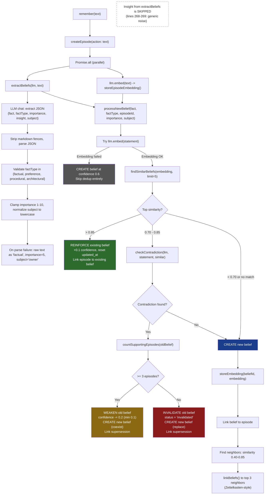
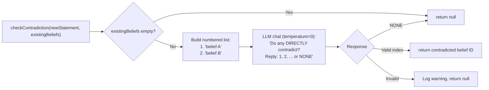
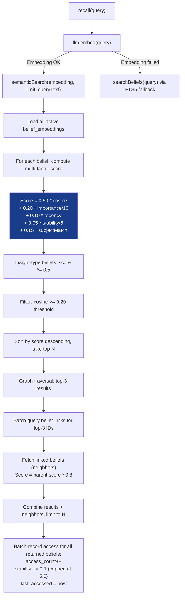
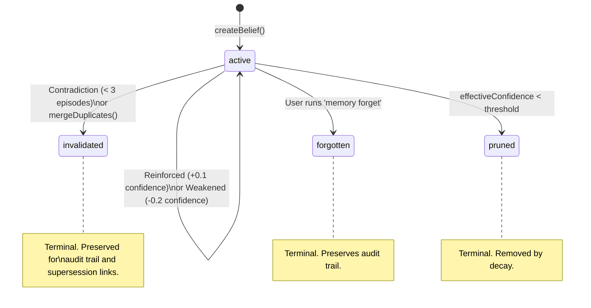

# Memory Lifecycle

This document maps the full lifecycle of beliefs in the Personal AI memory system, from ingestion through decay and removal. All diagrams and thresholds are derived from the source code in `packages/core/src/memory/`.

## 1. Ingestion: `remember()` and `processNewBelief()`

The `remember()` function in `remember.ts` is the primary entry point for storing new information. It creates an episode, extracts a structured belief via LLM, and runs deduplication/contradiction logic before persisting.



### `checkContradiction()` detail

The contradiction checker sends a batched prompt to the LLM with all candidate beliefs (those in the 0.70-0.85 similarity range). The LLM replies with a single belief index or `NONE`. Invalid responses (non-numeric, out of range) are treated as `NONE`.



## 2. Retrieval: `semanticSearch()` and `recall`

The recall path uses multi-factor scoring to rank beliefs, then traverses the Zettelkasten graph for linked neighbors.



### Recency calculation

```
recency = exp(-0.023 * daysSinceAccess)
```

This gives an approximately 30-day half-life. A belief accessed today scores 1.0; one accessed 30 days ago scores approximately 0.5.

### Subject-aware boosting

When the query text contains a known subject name (e.g., "Alex"), beliefs tagged with that subject receive `subjectMatch = 1.0` (contributing +0.15 to the score). Beliefs about other subjects get 0.0.

## 3. Maintenance Operations

```mermaid
flowchart TD
    subgraph Reflect
        R1["reflect(storage)"] --> R2["Load up to 200 active beliefs\nwith embeddings"]
        R2 --> R3["Find duplicate pairs:\ncosine >= 0.85"]
        R2 --> R4["Find stale beliefs:\neffectiveConfidence < 0.10"]
        R3 --> R5["Report duplicate clusters"]
        R4 --> R6["Report stale beliefs"]
    end

    subgraph Merge
        MR1["mergeDuplicates(clusters)"] --> MR2["For each cluster:\nSort by effectiveConfidence"]
        MR2 --> MR3["Keep highest-confidence belief (winner)"]
        MR3 --> MR4["Transfer episodes from losers to winner"]
        MR4 --> MR5["Invalidate losers\nSet superseded_by -> winner"]
        MR5 --> MR6["Reinforce winner (+0.1 confidence)"]
    end

    subgraph Synthesize
        S1["synthesize(storage, llm)"] --> S2["reflect(similarityThreshold=0.60)"]
        S2 --> S3["For each cluster (up to 5):"]
        S3 --> S4["LLM extracts one general principle\nfrom related beliefs"]
        S4 --> S5["CREATE meta-belief\nconfidence=0.8, stability=3.0, type='meta'"]
        S5 --> S6["Embed meta-belief"]
        S6 --> S7["Link meta-belief to all source beliefs"]
    end

    subgraph Prune
        P1["pruneBeliefs(threshold=0.05)"] --> P2["Load all active beliefs"]
        P2 --> P3["Filter: effectiveConfidence < threshold"]
        P3 --> P4["Set status='pruned' for each"]
        P4 --> P5["Log 'pruned' change"]
    end

    subgraph Decay
        DC1["effectiveConfidence(belief)"] --> DC2["confidence * 0.5^(days / halfLife)"]
        DC2 --> DC3["halfLife = 30 * stability"]
        DC3 --> DC4["stability=1.0 -> 30-day half-life\nstability=3.0 -> 90-day half-life\nstability=5.0 -> 150-day half-life"]
    end

    subgraph Forget
        F1["forgetBelief(beliefId)"] --> F2["Resolve ID (exact or prefix match)"]
        F2 --> F3["Set status='forgotten'\nLog 'forgotten' change"]
    end

    subgraph Consolidate
        C1["consolidateConversation(turns)"] --> C2{">= 4 turns?"}
        C2 -->|No| C3["return null"]
        C2 -->|Yes| C4["LLM summarizes conversation\n(1-3 sentences)"]
        C4 --> C5{Summary is 'NONE'?}
        C5 -->|Yes| C3
        C5 -->|No| C6["createEpisode(summary,\ncontext='conversation-consolidation')"]
        C6 --> C7["Embed and store episode embedding"]
    end
```



## 4. Similarity Thresholds

| Threshold | Value | Context | Behavior |
|-----------|-------|---------|----------|
| Reinforce (merge) | > 0.85 | `processNewBelief` | Incoming belief is merged into the existing one. Existing belief gets +0.1 confidence and reset `updated_at`. No new belief created. |
| Contradiction check | 0.70 - 0.85 | `processNewBelief` | Grey zone. LLM is asked whether the new statement contradicts an existing belief. If no contradiction, a new belief is created normally. |
| Zettelkasten linking | 0.40 - 0.85 | `processNewBelief` | After creating a new belief, neighbors in this range are linked via `belief_links` (max 3 links). |
| Duplicate detection | >= 0.85 | `reflect` | Used to identify near-duplicate clusters during reflection. |
| Thematic clustering | >= 0.60 | `synthesize` | Used to find thematic clusters for meta-belief synthesis. |
| Semantic search cutoff | >= 0.20 | `semanticSearch` | Cosine similarity floor. Beliefs below this threshold are excluded from search results regardless of other scoring factors. |
| Stale belief | < 0.10 | `reflect` | Beliefs with effective confidence below this are flagged as stale. |
| Prune default | < 0.05 | `pruneBeliefs` | Beliefs with effective confidence below this are set to `pruned` status. Configurable via `--threshold`. |
| Contradiction candidates | 0.40 - 0.85 | `findContradictions` | Range used by the curator plugin to find potential contradiction pairs for batch LLM analysis. |
| Episode similarity | > 0.30 | `getMemoryContext`, `retrieveContext` | Episodes must exceed this cosine threshold to be included in context output. |

## 5. Belief Statuses and Transitions

| Status | Description | How it's entered | Can transition to |
|--------|-------------|------------------|-------------------|
| `active` | Live belief, participates in search and context | Default status on creation via `createBelief()` | `invalidated`, `forgotten`, `pruned` |
| `invalidated` | Contradicted or merged away | Contradiction with < 3 supporting episodes, or merged as a duplicate loser | (terminal) |
| `forgotten` | User-initiated soft delete | `forgetBelief()` / `pai memory forget <id>` | (terminal) |
| `pruned` | Decayed below confidence threshold | `pruneBeliefs()` when `effectiveConfidence < threshold` | (terminal) |



## 6. Belief Properties

| Property | Default | Updated by | Description |
|----------|---------|------------|-------------|
| `confidence` | 0.6 | Reinforce (+0.1, cap 1.0), Weaken (-0.2, min 0.1) | Base confidence before decay. |
| `stability` | 1.0 | Access (+0.1, cap 5.0), Synthesize (set to 3.0 for meta) | Multiplier for decay half-life. `halfLife = 30 * stability` days. |
| `importance` | 1-10 (from LLM) | Set at creation | LLM-assigned importance. 1-3 trivial, 4-6 useful, 7-9 core, 10 critical. Normalized to 0-1 for scoring. |
| `type` | From LLM extraction | Set at creation | One of: `factual`, `preference`, `procedural`, `architectural`, `meta` (synthesized), `insight` (legacy default). |
| `subject` | `"owner"` | Set at creation, `backfillSubjects()` | Who the belief is about. Lowercase name or `"owner"`. |
| `access_count` | 0 | `semanticSearch()` batch access recording | Number of times the belief was returned in search results. |
| `last_accessed` | null | `semanticSearch()` batch access recording | Timestamp of last retrieval. Used for recency scoring. |
| `superseded_by` | null | `linkSupersession()` | Points to the newer belief that replaced this one. |
| `supersedes` | null | `linkSupersession()` | Points to the older belief this one replaced. |

## 7. Decay Formula

Effective confidence decays exponentially over time:

```
effectiveConfidence = confidence * 0.5 ^ (daysSinceUpdate / (30 * stability))
```

Examples:
- **stability = 1.0** (default): Half-life of 30 days. After 30 days, a belief at confidence 0.6 decays to 0.3.
- **stability = 3.0** (meta-beliefs): Half-life of 90 days. Much slower decay for synthesized knowledge.
- **stability = 5.0** (max, reached after 40 accesses): Half-life of 150 days.

Each time a belief is retrieved via `semanticSearch()`, its stability increases by 0.1 (capped at 5.0), following SM-2 spaced repetition principles. Frequently accessed beliefs naturally resist decay.

## 8. Conversation Consolidation

Every conversation chunk (when >= 4 turns) can be consolidated into a summary episode via `consolidateConversation()`. This runs as part of the chat pipeline (triggered every 5th chat turn by the server).

The consolidation flow:
1. Format conversation turns into `User: ... / Assistant: ...` text
2. LLM summarizes into 1-3 sentences (or replies `NONE` for trivial chat)
3. Create an episode with `context = "conversation-consolidation"`
4. Embed the summary for future semantic episode search

Consolidated episodes do **not** create beliefs. They serve as searchable episodic memory that can surface in `getMemoryContext()` and `retrieveContext()`.

## 9. Data Model

```
episodes              1---*  belief_episodes  *---1  beliefs
  |                                                    |
  +-- episode_embeddings                               +-- belief_embeddings
                                                       +-- belief_changes
                                                       +-- belief_links (self-join, Zettelkasten)
                                                       +-- supersedes / superseded_by (self-ref)
```

All tables live in a single SQLite database (`{dataDir}/personal-ai.db`) with WAL mode and foreign keys enabled. Migrations are tracked in the `_migrations` table.

## Source Files

- `packages/core/src/memory/remember.ts` -- `remember()`, `extractBeliefs()`, `checkContradiction()`, `processNewBelief()`
- `packages/core/src/memory/memory.ts` -- All CRUD, search, reflect, synthesize, merge, prune, decay, export/import
- `packages/core/src/memory/consolidate.ts` -- `consolidateConversation()`
- `packages/core/src/memory/index.ts` -- CLI commands and public API re-exports
