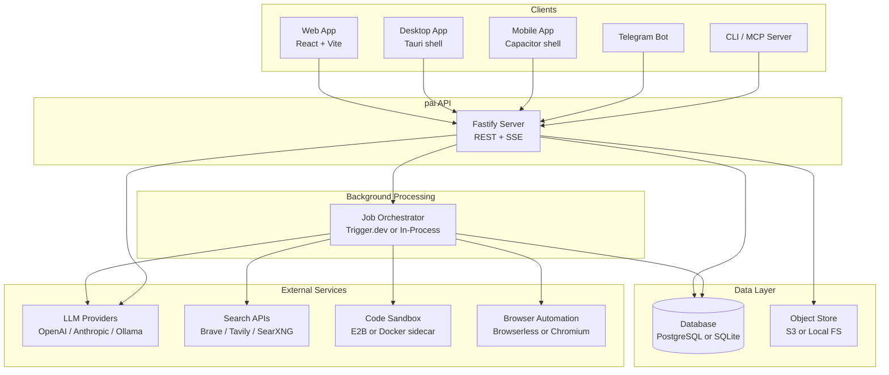
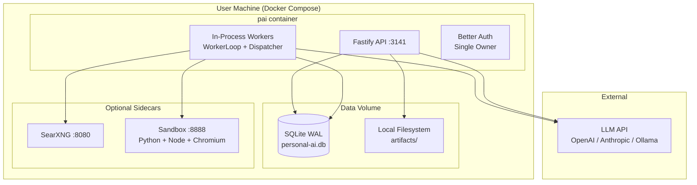
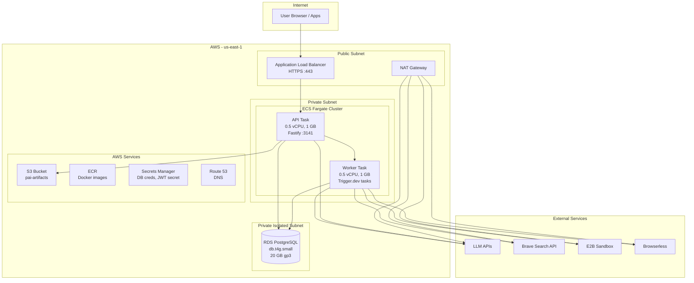
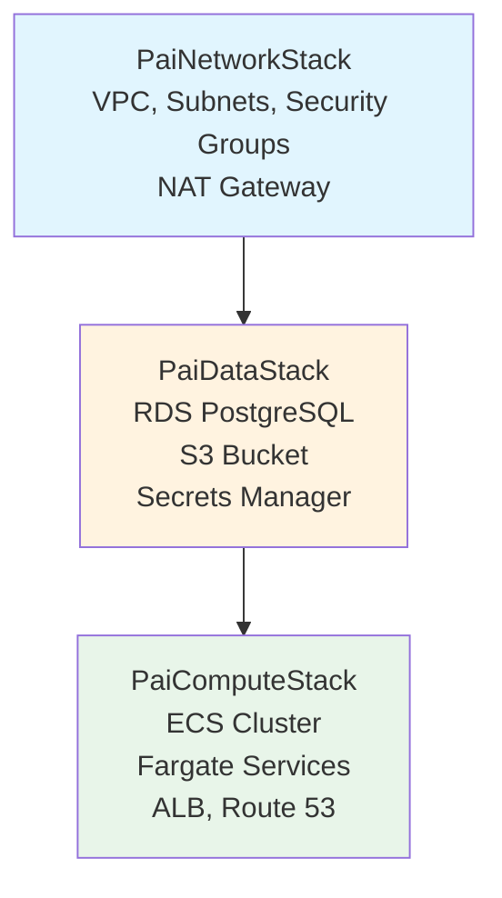
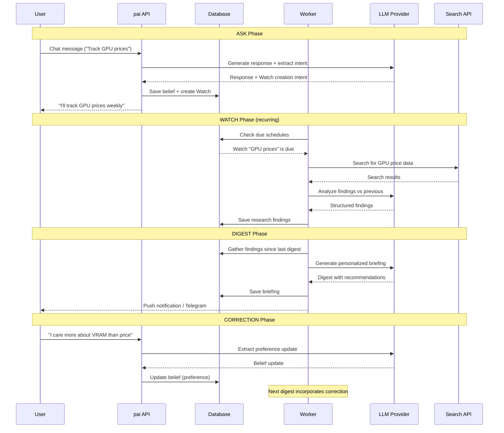
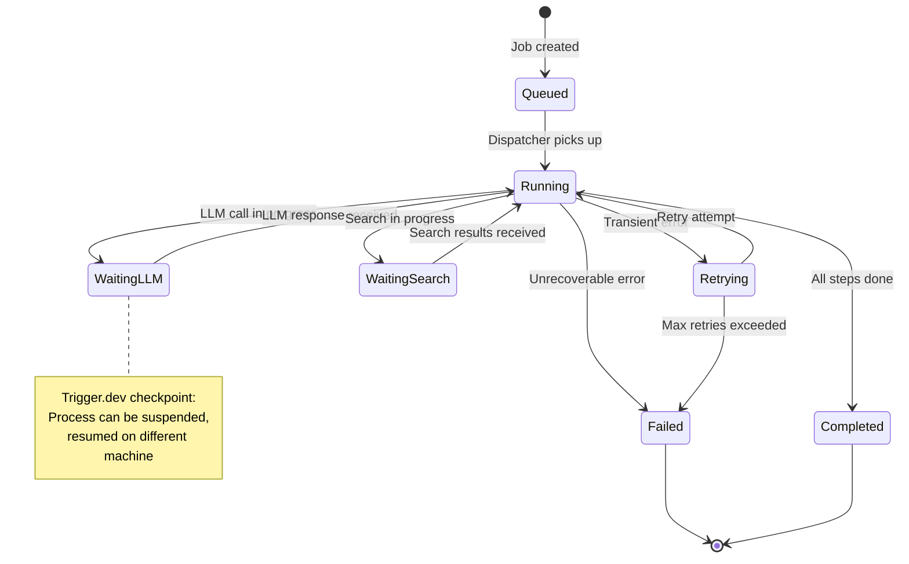
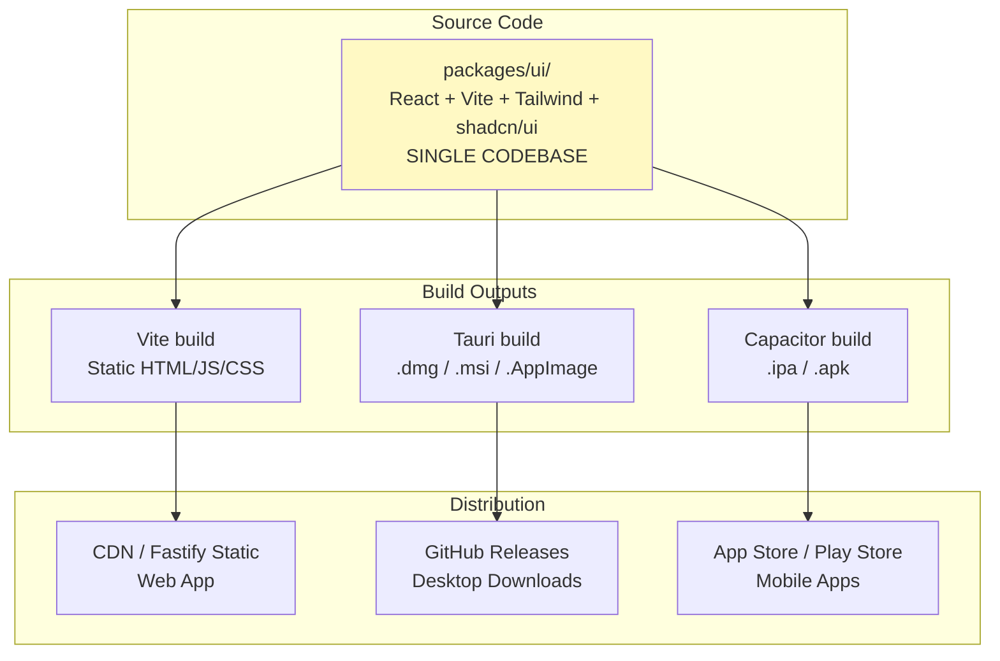
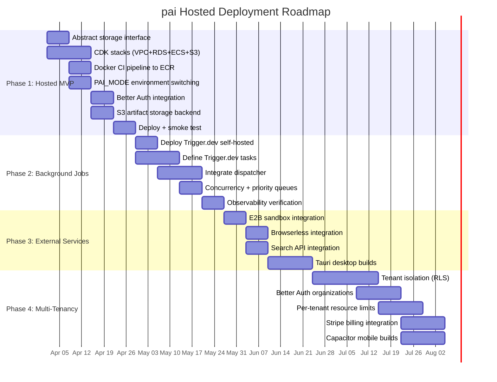

# pai Platform Design Diagrams

**Companion to:** [architecture.md](./architecture.md)
**Date:** 2026-03-24

---

## 1. High-Level System Context (All Tiers)



---

## 2. Self-Hosted Deployment

Everything runs on a single machine. No external infrastructure except LLM API keys.



### Docker Compose Structure (Self-Hosted)

```
docker-compose.yml
  services:
    pai:          # Main app (API + workers in-process)
      image: pai:latest
      ports: ["3141:3141"]
      volumes: ["pai-data:/data"]
      environment:
        PAI_MODE: self-hosted
        PAI_DATA_DIR: /data

    searxng:      # Optional: self-hosted search
      image: searxng/searxng
      ports: ["8080:8080"]
      profiles: ["search"]

    sandbox:      # Optional: code execution
      build: ./sandbox
      ports: ["8888:8888"]
      profiles: ["sandbox"]
```

---

## 3. Hosted MVP on AWS (Single Customer)



---

## 4. Hosted Multi-Tenant Architecture (Future)

```mermaid
graph TB
    subgraph "Clients"
        C1[Tenant A]
        C2[Tenant B]
        C3[Tenant C]
    end

    subgraph "Edge"
        CF[CloudFront CDN<br/>Static UI assets]
        ALB2[ALB<br/>Host-based routing]
    end

    subgraph "Compute (ECS Fargate)"
        APIS[API Service<br/>Auto-scaling 2-10 tasks<br/>Stateless]
        WORKS[Worker Service<br/>Trigger.dev<br/>Per-tenant queues]
    end

    subgraph "Data"
        PG[(RDS PostgreSQL<br/>Row-Level Security<br/>tenant_id on all tables)]
        S32[S3<br/>/{tenant_id}/artifacts/]
    end

    subgraph "Auth"
        BA[Better Auth<br/>Organizations + Roles<br/>Social Login + SSO]
    end

    subgraph "Billing"
        STRIPE[Stripe<br/>Subscriptions + Usage]
    end

    C1 --> CF
    C2 --> CF
    C3 --> CF
    CF --> ALB2
    ALB2 --> APIS
    APIS --> BA
    APIS --> PG
    APIS --> S32
    APIS --> WORKS
    WORKS --> PG
    APIS --> STRIPE
```

---

## 5. CDK Stack Dependency Graph



### CDK Stack Contents

```
PaiNetworkStack
  |-- VPC (2 AZs, 1 NAT Gateway)
  |-- Public subnets (ALB, NAT)
  |-- Private subnets (Fargate tasks)
  |-- Private isolated subnets (RDS)
  |-- Security groups (api-sg, worker-sg, db-sg)

PaiDataStack (depends on Network)
  |-- RDS DatabaseInstance (PostgreSQL 16, t4g.small)
  |-- S3 Bucket (pai-artifacts, lifecycle rules)
  |-- Secrets Manager (DB credentials, JWT secret, API keys)

PaiComputeStack (depends on Data)
  |-- ECS Cluster
  |-- ECR Repository
  |-- ApplicationLoadBalancedFargateService (API)
  |-- FargateService (Worker)
  |-- ACM Certificate (HTTPS)
  |-- Route 53 Record (DNS)
```

---

## 6. Data Flow: Core Product Loop



---

## 7. Background Job Lifecycle



---

## 8. Auth and Tenancy Model

```
SELF-HOSTED (Single Owner)
================================
+---------------------------+
|  Better Auth              |
|  - Email/Password         |
|  - Optional Passkey       |
|  - Single session         |
|  - SQLite backend         |
+---------------------------+
         |
    [pai instance]
         |
    [SQLite DB - no tenant_id]


HOSTED DEDICATED (Single Workspace)
====================================
+---------------------------+
|  Better Auth              |
|  - Email/Password         |
|  - Google Social Login    |
|  - Workspace invitations  |
|  - PostgreSQL backend     |
+---------------------------+
         |
    [Fargate task per customer]
         |
    [Separate DB per customer on shared RDS]


HOSTED SHARED (Multi-Tenant)
==============================
+---------------------------+
|  Better Auth              |
|  - All auth methods       |
|  - Organizations          |
|  - Roles & Permissions    |
|  - SSO / SAML (enterprise)|
|  - PostgreSQL backend     |
+---------------------------+
         |
    [Shared Fargate service]
         |
    [Shared DB with RLS]
    [Every table has tenant_id]
    [Row-Level Security policies]
```

---

## 9. Client Architecture



### Build Pipeline

```
GitHub Actions CI
  |
  +-- on push to main:
  |     |-- pnpm build (all packages)
  |     |-- pnpm verify (typecheck + test)
  |     |-- docker build + push to ECR
  |     |-- CDK deploy to staging
  |
  +-- on release tag:
        |-- All of the above, plus:
        |-- Tauri build (macOS, Windows, Linux)
        |-- Capacitor build (iOS, Android)
        |-- Upload to GitHub Releases
        |-- Submit to App Store / Play Store
```

---

## 10. Network Topology (AWS)

```
                    Internet
                       |
                  [Route 53]
                       |
              [ACM Certificate]
                       |
    +---------[ALB (public)]---------+
    |                                |
    |    Public Subnet AZ-a          |    Public Subnet AZ-b
    |    [NAT Gateway]               |
    |         |                      |
    |    Private Subnet AZ-a         |    Private Subnet AZ-b
    |    [Fargate: API task]         |    [Fargate: API task]  (auto-scale)
    |    [Fargate: Worker task]      |    [Fargate: Worker task]
    |         |                      |
    |    Private Isolated AZ-a       |    Private Isolated AZ-b
    |    [RDS Primary]               |    [RDS Standby]  (Multi-AZ, future)
    |                                |
    +--------------------------------+

    AWS Services (via VPC Endpoints or NAT):
      - S3 (Gateway Endpoint, free)
      - ECR (Interface Endpoint or NAT)
      - Secrets Manager (Interface Endpoint or NAT)
      - CloudWatch (Interface Endpoint or NAT)
```

---

## 11. Migration Phases Visual



---

## 12. Cost Breakdown Visual

```
Monthly Cost Breakdown: Hosted MVP (Single Customer)
=====================================================

AWS Infrastructure           ~$110/month
  |-- ECS Fargate (API)        $14  ████
  |-- ECS Fargate (Worker)     $14  ████
  |-- RDS PostgreSQL           $25  ██████
  |-- ALB                      $22  █████
  |-- NAT Gateway              $32  ████████
  |-- S3 + ECR + SM + R53       $3  █

External Services             ~$5/month
  |-- Brave Search              $3  █
  |-- E2B Sandbox               $1
  |-- Browserless               $0  (free tier)

LLM Costs (estimated)        ~$93/month
  |-- Chat (50 msgs/day)      $15  ████
  |-- Research (5 jobs/day)    $75  ██████████████████
  |-- Digests (1/day)           $3  █

TOTAL                        ~$210/month
                              ========

With optimizations (fck-nat, smaller RDS, Fargate Spot):
AWS Infrastructure drops to  ~$60/month
TOTAL drops to               ~$160/month
```

---

## 13. Decision Matrix Summary

```
                    Self-Hosted    Hosted MVP    Hosted Multi-Tenant
                    ===========    ==========    ===================
Compute             Docker         ECS Fargate   ECS Fargate (auto-scale)
Database            SQLite         RDS PG small  RDS PG / Aurora Sv2
Workers             In-process     Trigger.dev   Trigger.dev (tenant queues)
Artifacts           Local FS       S3            S3 (tenant prefixes)
Search              SearXNG        Brave API     Brave + Tavily + Exa
Sandbox             Docker sidecar E2B           E2B
Browser             Chromium sidecar Browserless Browserless
Auth                Better Auth    Better Auth   Better Auth (orgs + SSO)
Desktop             N/A            Tauri         Tauri
Mobile              N/A            Capacitor     Capacitor
IaC                 docker-compose CDK (3 stacks) CDK (3 stacks)
```
